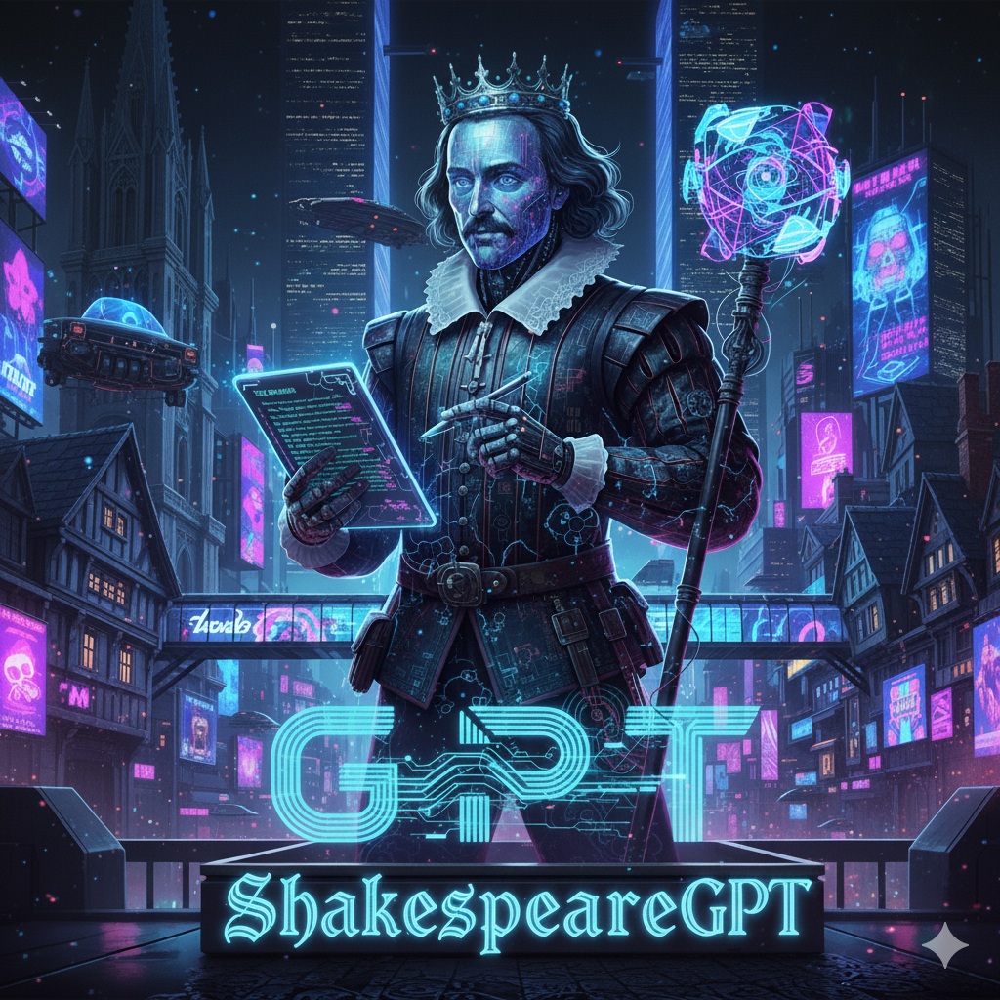

# ShakespeareGPT-10M

<div align="center">
  
</div>

A small-scale GPT language model trained on Shakespeare's works, built from scratch using PyTorch. This implementation features a transformer architecture with approximately 10 million parameters, designed to generate text in the style of Shakespeare.

## 🎭 Overview

This project implements a character-level GPT (Generative Pre-trained Transformer) model trained exclusively on Shakespeare's corpus. The model learns to predict the next character in a sequence, allowing it to generate coherent text that mimics Shakespeare's writing style.

## 🏗️ Architecture

- **Model Size**: ~10M parameters
- **Architecture**: Decoder-only Transformer
- **Context Length**: 256 characters
- **Embedding Dimensions**: 384
- **Attention Heads**: 6
- **Transformer Layers**: 6
- **Vocabulary**: Character-level (all unique characters in the dataset)

### Key Components:
- **Multi-Head Self-Attention**: 6 attention heads for capturing different linguistic patterns
- **Feed-Forward Networks**: Position-wise fully connected layers
- **Layer Normalization**: Applied before each sub-layer (Pre-LN architecture)
- **Residual Connections**: Skip connections around each sub-layer
- **Positional Encoding**: Learned positional embeddings

## 📁 Project Structure

```
gpt-10m/
├── src/
│   ├── model.py          # GPT model architecture
│   ├── train.py          # Training script
│   └── generate.py       # Text generation script
├── data/
│   └── little-shakespear/
│       └── input.txt     # Shakespeare corpus
├── __pycache__/
│   └── gpt_model.pth     # Trained model weights
├── requirements.txt      # Python dependencies
└── README.md            # This file
```

## 🚀 Installation

1. **Clone the repository**:
   ```bash
   git clone https://github.com/m-cnan/ShakespeareGPT-10M.git
   cd ShakespeareGPT-10M
   ```

2. **Install dependencies**:
   ```bash
   pip install -r requirements.txt
   ```

3. **Verify PyTorch installation**:
   ```bash
   python -c "import torch; print(f'PyTorch version: {torch.__version__}')"
   ```

## 📊 Training

The model is trained using the following hyperparameters:

- **Batch Size**: 64
- **Learning Rate**: 3e-4
- **Max Iterations**: 5,000
- **Optimizer**: AdamW
- **Device**: CUDA (if available) or CPU
- **Dropout**: 0.2
- **Train/Val Split**: 90/10

### To train the model:

```bash
cd src
python train.py
```

During training, you'll see output like:
```
10.788929 M parameters
step 0: train loss 4.2845, val loss 4.2960
step 500: train loss 1.8321, val loss 2.0458
step 1000: train loss 1.4782, val loss 1.7632
...
Model saved to __pycache__/gpt_model.pth
```

Training takes approximately:
- **CPU**: 2-4 hours
- **GPU**: 15-30 minutes

## 🎨 Text Generation

Once trained, generate Shakespeare-style text:

```bash
cd src
python generate.py
```

The script will:
1. Load the trained model
2. Start with "Hello World" as context
3. Generate 1000 new characters
4. Display the generated text

### Example Output:
```
Hello World, and the sea of the world,
And the sun shall be the soul of the world,
That the world shall be the earth and the earth
Shall be the sun and moon and stars above...
```

## ⚙️ Configuration

Key hyperparameters can be modified in `src/model.py`:

```python
# Model hyperparameters
batch_size = 64        # Batch size for training
block_size = 256       # Context window size
max_iters = 5000      # Training iterations
learning_rate = 3e-4   # Learning rate
n_embd = 384          # Embedding dimensions
n_head = 6            # Number of attention heads
n_layer = 6           # Number of transformer layers
dropout = 0.2         # Dropout rate
```

## 📈 Performance

The model achieves:
- **Training Loss**: ~1.2-1.5 (after 5k iterations)
- **Validation Loss**: ~1.8-2.2 (after 5k iterations)
- **Generation Quality**: Coherent Shakespeare-style text with some :) grammar and vocabulary

## 🛠️ Technical Details

### Character-Level Tokenization
- Uses all unique characters from the Shakespeare corpus
- Simple character-to-integer mapping
- Vocabulary size: ~65-100 characters (letters, punctuation, spaces)

### Model Architecture Details
- **Attention Mechanism**: Scaled dot-product attention with causal masking
- **Feed-Forward**: Hidden dimension of 4x embedding size (1536)
- **Activation**: ReLU in feed-forward networks
- **Weight Initialization**: Normal distribution (mean=0, std=0.02)

### Training Process
1. **Data Preparation**: Character-level encoding of Shakespeare text
2. **Batching**: Random sampling of sequences with context length 256
3. **Loss Function**: Cross-entropy loss for next-character prediction
4. **Optimization**: AdamW optimizer with learning rate 3e-4
5. **Evaluation**: Periodic loss computation on validation set


## 📚 Dataset

The model is trained on Shakespeare's complete works, specifically:
- **Source**: Project Gutenberg Shakespeare corpus
- **Size**: ~40,000 lines of text
- **Content**: Plays, sonnets, and other works
- **Preprocessing**: Minimal (preserves original formatting and punctuation)


## 📜 License

This project is open source and available under the MIT License.

## 🙏 Acknowledgments

- Inspired by Andrej Karpathy's "GPT from Scratch" tutorials
- Shakespeare corpus from Project Gutenberg
- PyTorch team for the excellent framework

## 📞 Contact

- **Author**: m-cnan
- **Repository**: [ShakespeareGPT-10M](https://github.com/m-cnan/ShakespeareGPT-10M)

---

*"All the world's a stage, and all the men and women merely players..."* 
